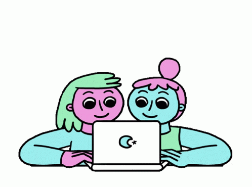

# Girls Who Code Queens College

Our mission is to create a community and safe space for underrepresented minorities who are looking to get a peek into what the STEM field is like. We have workshops planned where we will be showing our members important skills that are currently popular in technology workplaces. We also host fun events to connect with others virtually, make friends with similar interests, and create amazing memories. We have started to reach out to other communities, such as high schools, so we can inspire young women to pursue STEM. Since we are virtual, it can be difficult for students to feel they are prepared for the future or have the guidance and support of others. Girls Who Code QC recognizes this and strives to eliminate this mindset from students and help them prepare and gain confidence to succeed in their careers in STEM. 

## 📝Past Workshops

Workshop Topics have included
Git & GitHub, Game Development, Python and Data Analytics, Web Development, Figma, Career Development and more!

[Intro to Python Series](https://github.com/GWC-QC/Python_Series)

[Intro to Unity](https://github.com/GWC-QC/GWC_Intro-To-Unity)

[Intro to Git & Github](https://github.com/GWC-QC/IntroToGit)

## Technical Skills our Members possess
* Java
* Python
* Unity
* Node.Js and JavaScript
* Figma 

- 👯 I’m looking to collaborate on ...
- 🤔 I’m looking for help with ...
- 💬 Ask me about ...
- 📫 How to reach me: ...
- ⚡ Fun fact: ...
-->
